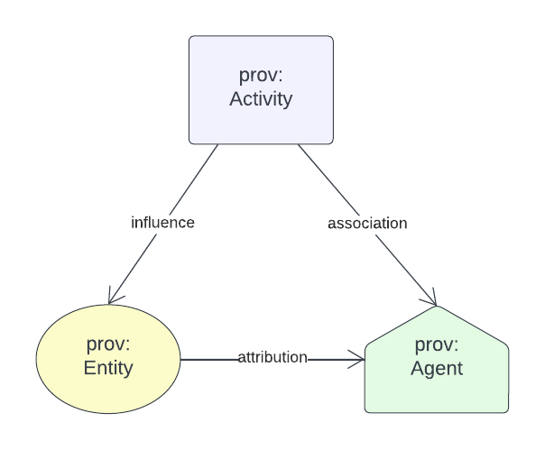
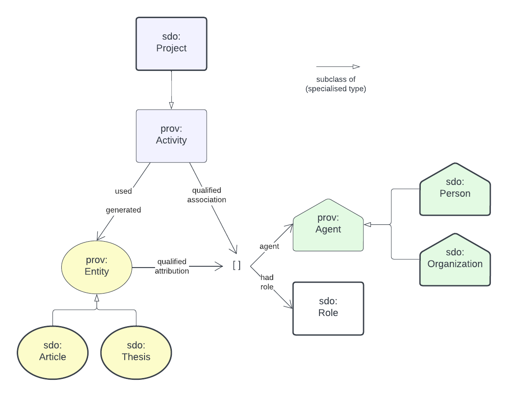
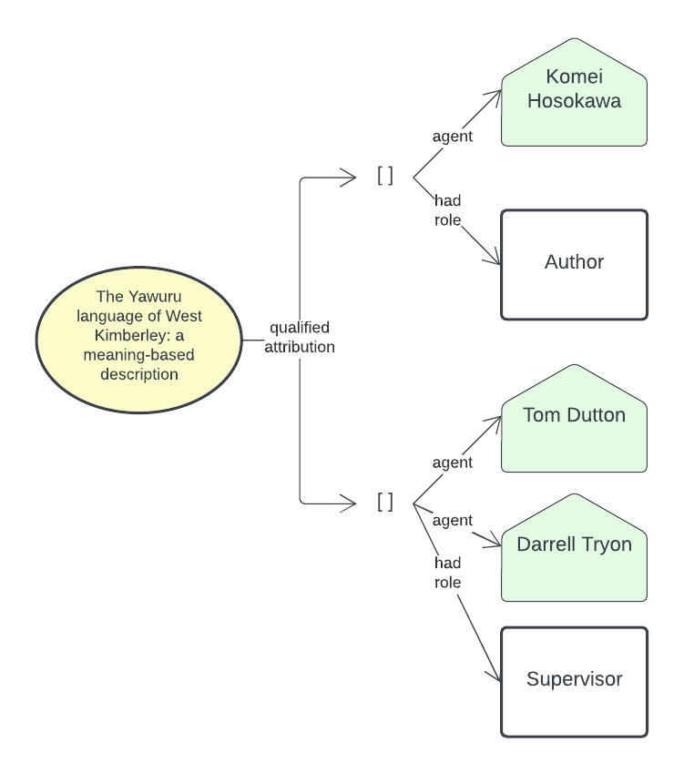

# Research Graph - Model

## Basics

This model related persons & organisations ("Agents") to projects and other Activities as well as Agents and Activities to things produced by them ("Entities").

## Details

The specific kinds of Agents expected to be used are Persons & Organisations; of Activities are Projects; and of Entities are Thesis, Articles etc.

Also, we record the Role that Agents play in relation to Projects and the generation of Thesis etc.

## Example

Here is a Thesis, from this Research Graph example data, modelled visually:

